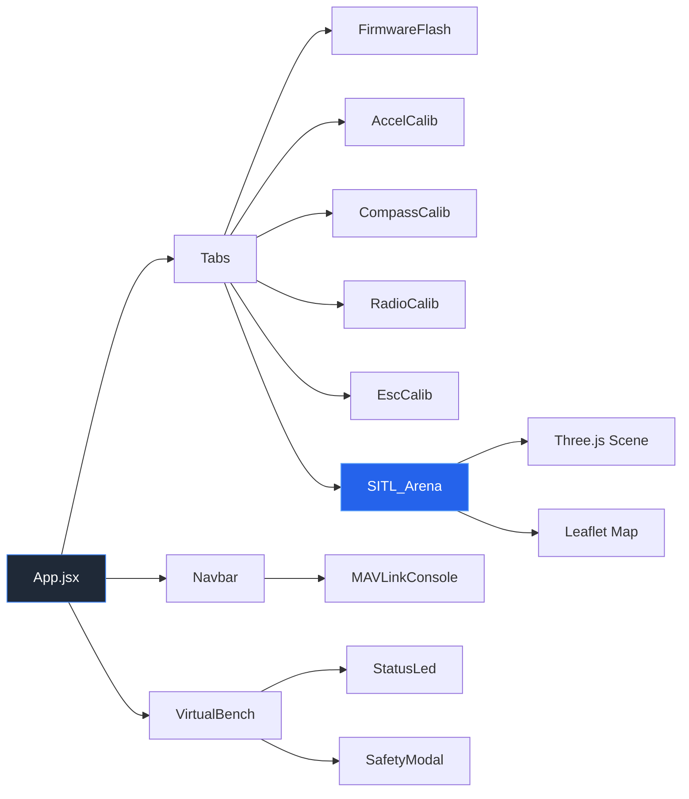

# 🚁 Mission Planner Interactive GCS & ArduPilot Commissioning Simulator

[](https://react.dev/)
[](https://vitejs.dev/)
[](https://tailwindcss.com/)
[](https://threejs.org/)
[](https://leafletjs.com/)
[](LICENSE)

---

## 🎯 Overview

**Mission Planner Interactive GCS & ArduPilot Commissioning Simulator** is a single‑page, browser‑based application that lets you **experience the full end‑to‑end drone commissioning workflow** without any physical hardware.  It is built for:

- **Drone hobbyists** learning how to flash firmware, calibrate sensors and configure radio controls.
- **UAV engineers** who need a quick sandbox for testing ArduPilot workflows.
- **Students** looking for an interactive teaching tool for a university‑level UAV course.

The simulator reproduces the **Virtual Bench**, **Firmware Flash Wizard**, **Accelerometer & Compass calibrations**, **RC transmitter setup**, **ESC throttle programming**, and a **3‑D SITL flight arena** with live GIS mapping—all inside a sleek, dark‑mode UI.

---

## ✨ Key Features

- **Realistic Virtual Bench** – Simulated USB, LiPo, safety switch and propeller safety system.
- **Bootloader & Firmware Flashing** – Interactive wizard that mimics the bootloader handshake, COM‑port lock handling, and firmware upload progress.
- **Physics‑Enforced Accelerometer Calibration** – 6‑position calibration requiring 2 seconds of absolute stillness per pose.
- **3‑D Compass Calibration** – 120‑point Fibonacci sphere sampling with optional auto‑orbit mode.
- **Mode‑2 Virtual RC Transmitter** – Drag‑and‑drop joysticks with live PWM bars and automatic pitch‑channel reversal detection.
- **All‑At‑Once ESC Calibration** – Five‑step wizard with realistic audio cues (ESC chimes, motor spin‑up).
- **3‑D SITL Arena** – Three.js powered flight view, live Leaflet map centered on **UTU Maliba Campus**, GPS trail, altitude read‑out and multiple flight‑mode controls (STABILIZE, ALT_HOLD, POSHOLD, RTL, LAND).
- **MAVLink Telemetry Console** – Real‑time log filtering, export, and audio mute control.
- **Responsive Design** – Works on desktop browsers; UI automatically adapts to window size.

---

## 📸 Screenshots (Placeholders)

> 📷 _Screenshots are generated as placeholders – replace with actual images when available._


---

## 📖 Detailed Step‑by‑Step User Guide

The following workflow must be followed in order.  Each stage unlocks the next.

### 1️⃣ Physical Virtual Bench

- **Safety First – Remove Props** – A red banner appears if props are installed. Click **“REMOVE PROPS NOW”**.
- **Power the Autopilot** – Click **“PLUG USB”**; the Autopilot LED turns green.
- **Optional LiPo Power** – Toggle the **LiPo** button to simulate a 4S battery connection.

### 2️⃣ Firmware Flashing

1. Open the **“2. Firmware Flash”** tab.
2. **Disconnect MAVLink** if the top navbar shows a **CONNECTED** badge – click the button to disconnect (the bootloader needs a free COM port).
3. Choose a vehicle firmware (e.g., **ArduCopter Quad V4.5.1 Stable**) and click **“Initiate Firmware Flash”**.
4. Confirm the upload in the modal; current parameters are automatically backed up.
5. When the **BOOTLOADER RESET REQUIRED!** modal appears, click the button to **UNPLUG USB** and **PLUG USB** again on the Virtual Bench.
6. Watch the flashing progress bar. After completion, the board reboots into the selected firmware.

### 3️⃣ 3‑Axis Accelerometer Calibration

- **Goal** – Capture gravity offsets across six cardinal orientations.
- **Stillness Rule** – After clicking **“Click when Done”** for a position, keep the mouse completely still for **2 seconds**. Any movement triggers an **Accel Inconsistent** failure.
- **Positions**:
  1. **LEVEL (Top Up)** – Drone flat.
  2. **LEFT SIDE** – Tilt onto the left edge.
  3. **RIGHT SIDE** – Tilt onto the right edge.
  4. **NOSE DOWN** – Nose points down.
  5. **NOSE UP** – Nose points up.
  6. **BACK (Bottom Up)** – Invert the drone.
- Successful completion shows a green success banner.

### 4️⃣ 3‑D Compass Calibration

- Open the **“4. Compass 3D”** tab.
- **Manual Rotation** – Click‑drag the globe to rotate the drone in pitch, roll, and yaw.
- **Auto‑Orbit Mode** – Toggle the auto‑orbit button for a continuous Lissajous sweep.
- The 120‑point Fibonacci sphere turns green as each magnetic sample is captured.
- When the counter reads **120 / 120 (100 %)**, the calibration is complete.
- **Quick Calibrate** button instantly fills all points (useful for demos).

### 5️⃣ Radio Control (RC) Calibration

- Navigate to **“5. Radio Setup”**.
- **Virtual Mode‑2 Transmitter** – Two joysticks:
  - **Left Stick** – Yaw (CH4) left/right; Throttle (CH3) up/down.
  - **Right Stick** – Roll (CH1) left/right; Pitch (CH2) up/down.
- Drag each joystick to its extremes so **PWM bars** reach **1100 µs** (min) and **1900 µs** (max).
- **Pitch Channel Reversal** – If the banner warns `CHANNEL REVERSAL REQUIRED!`, click **“TOGGLE REVERSE CH2”** to invert the channel direction.
- Click **“Save Calibration”** when all channels are within range.

### 6️⃣ All‑At‑Once ESC Throttle Calibration

- Open the **“6. ESC Throttle”** tab.
- Follow the five‑step wizard in order:
  1. **Set Throttle to MAX (1900 µs)** – Click the button.
  2. **Plug LiPo Battery** – Simulates power to ESCs.
  3. **Unplug & Re‑plug LiPo** – Triggers ESC programming mode (listen for a short musical chime).
  4. **Press FC Safety Switch** – Turns the safety LED solid red and allows PWM pass‑through.
  5. **Pull Throttle to MIN (1100 µs)** – Click the button (listen for a longer confirmation chime).
- A green banner confirms **ESC Calibration Complete**.

### 7️⃣ 3‑D SITL Flight Arena

> **Note:** The SITL arena tab remains locked until **all previous steps** (Firmware, Accel, Compass, Radio, ESC) are finished.

- Open the **“7. 3D SITL Arena”** tab.
- **Connect MAVLink** (green CONNECTED badge). If still connected from flashing, click **DISCONNECT** first, then reconnect.
- **Arm the Drone** – Press **“ARM DRONE”**. You’ll hear motor spin‑up audio and see propellers start rotating.
- **Takeoff** – Adjust the altitude slider (e.g., 10 m) and click **“TAKEOFF”**.
- **Flight Modes**:
  - **STABILIZE** – Manual control with self‑leveling.
  - **ALT_HOLD** – Maintains current altitude.
  - **POSHOLD** – Holds 3‑D GPS position.
  - **RTL** – Returns to the **UTU Maliba Campus** helipad.
  - **LAND** – Autonomous vertical landing.
- **Map View** – Leaflet map centered at **21.0686° N, 73.1329° E** displays the drone’s GPS track, altitude, speed, and satellite lock count.
- **Telemetry Console** – Bottom console streams live MAVLink messages, system status, and any error logs.

---

## 🏗️ Architecture Overview

The application is a **React + Vite** single‑page app using several libraries to provide its features.



- **React Context (`SimulatorContext`)** maintains the global state for all calibration stages, safety flags, and telemetry.
- **Three.js** renders the 3‑D flight arena and drone model.
- **Leaflet** displays a GIS map with real‑time GPS tracking.
- **Web Audio API** (`audioSynthesizer.js`) provides realistic ESC beeps, motor spin‑up, and alert tones.
- **Lucide‑React icons** give a modern, vector‑based UI.

---

## 📁 Project Structure

```text
DroneLearing/
├─ public/                # Static assets (favicon, manifest)
├─ src/
│  ├─ assets/            # Images & icons used in UI
│  ├─ audio/             # audioSynthesizer.js – Web Audio engine
│  ├─ components/
│  │   ├─ common/        # StatusLed, MavlinkConsole, etc.
│  │   ├─ tabs/          # Each commissioning tab component
│  │   ├─ Navbar.jsx
│  │   ├─ SafetyModal.jsx
│  │   └─ VirtualBench.jsx
│  ├─ context/           # SimulatorContext – global state
│  ├─ App.jsx
│  ├─ index.css
│  └─ main.jsx            # Vite entry point
├─ .gitignore
├─ .oxlintrc.json        # Lint configuration
├─ index.html
├─ package.json
├─ vite.config.js
└─ README.md
```

---

## 🛠️ Development & Contribution

> **Note:** This section is optional for end‑users.  It is kept for developers who wish to extend the simulator.

1. **Clone the repo** (if you are a contributor).
2. Run `npm install` to install dependencies.
3. Use `npm run dev` to start the development server.
4. Follow the **User Guide** above to test new features.
5. Submit a Pull Request with a clear description of changes.

---

## 📜 License

Distributed under the **MIT License**. See the [LICENSE](LICENSE) file for details.

---

## 🙏 Acknowledgments

- **Uka Tarsadia University (UTU)** – Providing the campus GPS reference.
- **ArduPilot Community** – For the open‑source autopilot stack.
- **Lucide** – Icon library.
- **Three.js**, **Leaflet**, **Vite**, **TailwindCSS** – Core libraries powering the UI.

---

<p align="center">
  <i>Designed to help you master ArduPilot commissioning from the comfort of a web browser.</i>
</p>
